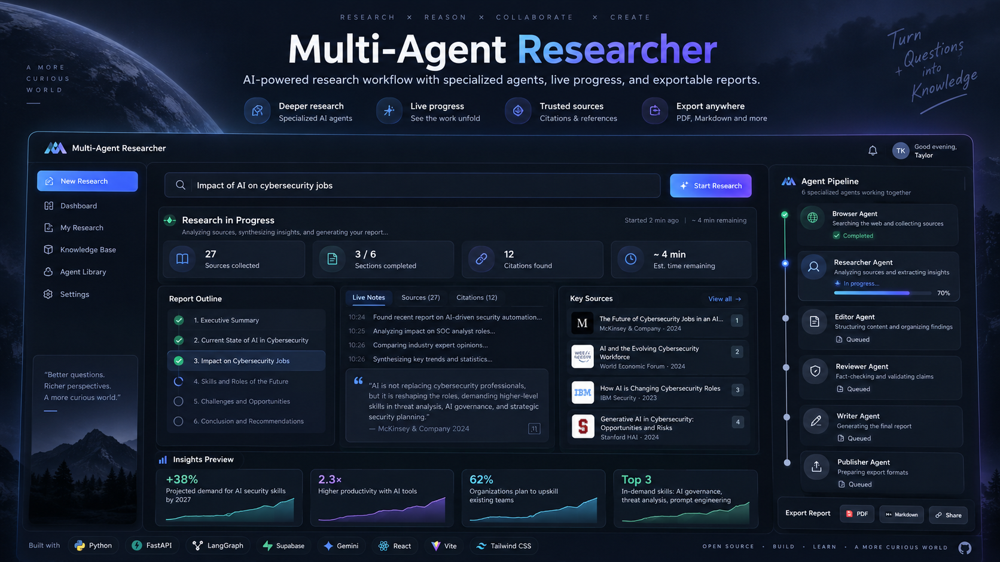
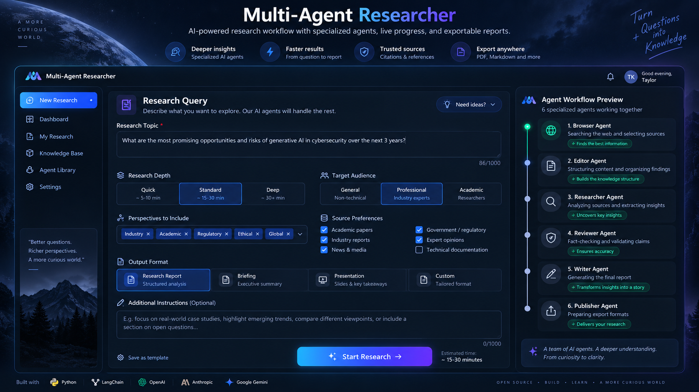
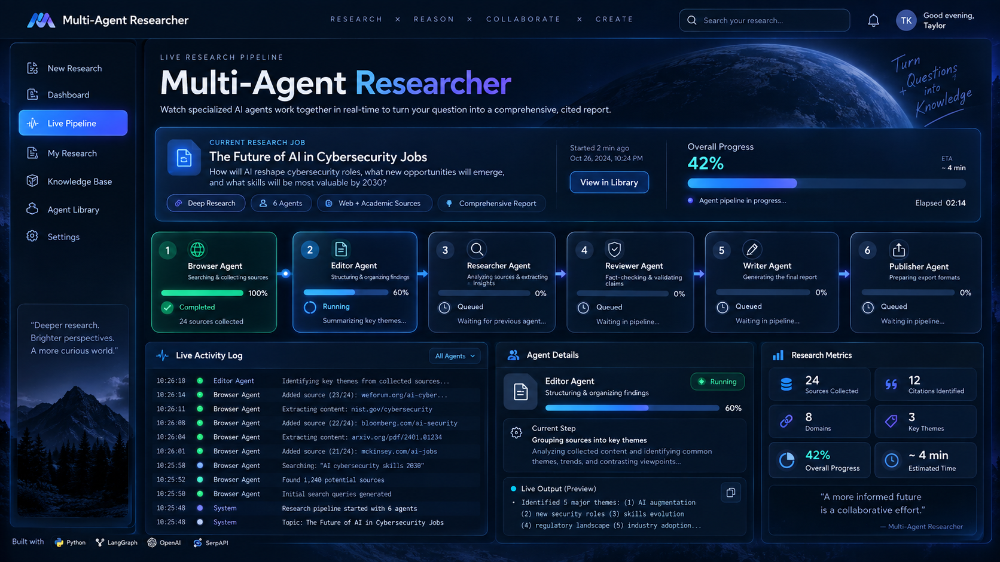
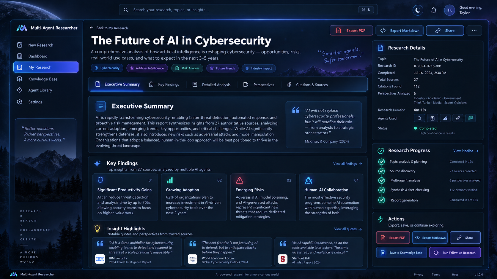
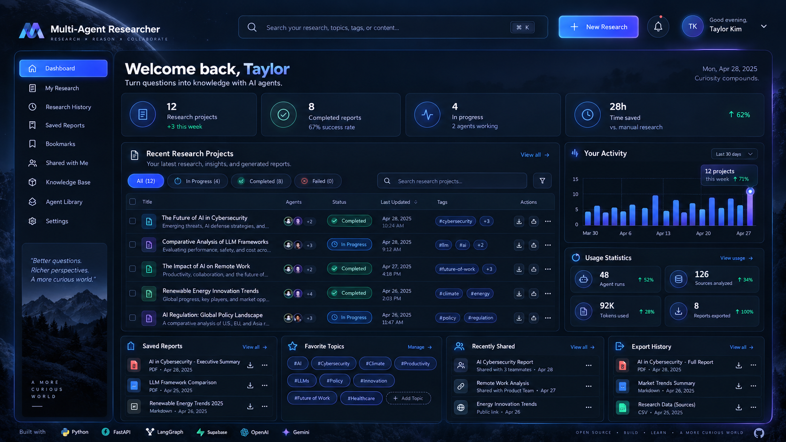
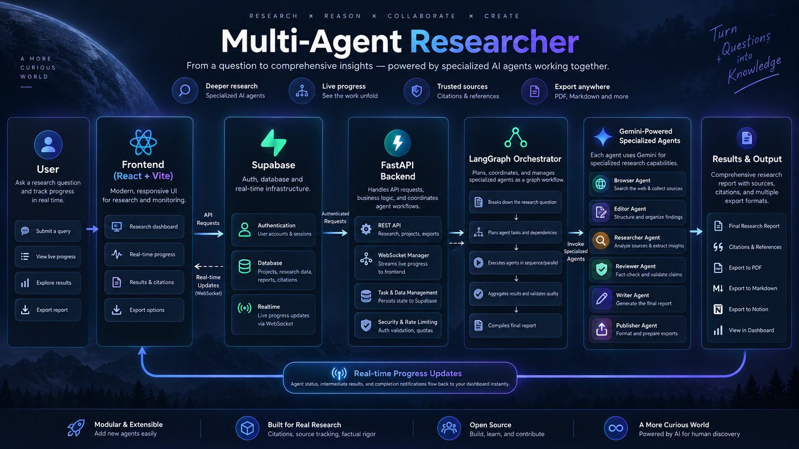

<p align="center">
  
</p>

<h1 align="center">Multi-Agent Researcher</h1>

<p align="center">
  <strong>AI-powered research platform that plans, searches, analyzes, reviews, writes, and publishes research through a team of specialized agents.</strong>
</p>

<p align="center">
  
  
  
  
  
  
  
  
</p>

<p align="center">
  <a href="#-overview">Overview</a> •
  <a href="#-product-preview">Preview</a> •
  <a href="#-features">Features</a> •
  <a href="#-architecture--workflow">Architecture</a> •
  <a href="#-setup-local-development">Setup</a> •
  <a href="#-api-endpoints">API</a> •
  <a href="#-deployment">Deployment</a>
</p>

---

## 🚀 Overview

**Multi-Agent Researcher** is a full-stack, AI-powered research assistant platform. It transforms a user query into a structured, cited, exportable research report by coordinating multiple specialized agents through a workflow engine. The platform supports real-time progress tracking, user authentication, persistent research history, and a modern dashboard experience for submitting, monitoring, and reviewing research jobs.

Instead of relying on a single LLM response, the system breaks research into stages such as search, outlining, deep analysis, review, writing, and publishing. That makes the workflow easier to inspect, extend, and improve over time.

---

## 🎬 Product Preview

> [!NOTE]
> The images below are professional product visuals created for this repository and organized to match the README structure.

### 1. Hero Overview

<p align="center">
  
</p>

A premium overview of the product vision: research orchestration, live progress, source awareness, and export-ready reporting.

---

<table>
<tr>
<td width="50%" valign="top">

### 2. Research Query Submission



Users can define the research topic, depth, audience, perspectives, source preferences, and output format before launching a job.

</td>
<td width="50%" valign="top">

### 3. Live Research Pipeline



A real-time pipeline view shows which agent is active, what step is running, and how much progress has been completed.

</td>
</tr>
<tr>
<td width="50%" valign="top">

### 4. Research Results Viewer



The final report experience includes summaries, key findings, citations, progress history, and export actions.

</td>
<td width="50%" valign="top">

### 5. User Dashboard & History



A central dashboard helps users revisit projects, check activity, browse exports, and track usage statistics.

</td>
</tr>
</table>

### 6. Architecture & Workflow Diagram

<p align="center">
  
</p>

A high-level system diagram showing how the frontend, backend, database, authentication, orchestration layer, and specialized agents work together.

---

## Contents

- [Overview](#-overview)
- [Product Preview](#-product-preview)
- [Features](#-features)
- [Architecture & Workflow](#-architecture--workflow)
  - [How it Works](#how-it-works)
  - [Agent Pipeline](#agent-pipeline)
- [Tech Stack Explained](#-tech-stack-explained)
- [Setup (Local Development)](#-setup-local-development)
  - [Backend](#backend)
  - [Frontend](#frontend)
- [API Endpoints](#-api-endpoints)
- [User Experience Flow](#-user-experience-flow)
- [Deployment](#-deployment)
- [Contributing](#-contributing)
- [License](#-license)

---

## ✨ Features

- **Automated Multi-Agent Research:** Submit a topic and let a pipeline of specialized agents handle search, outlining, research, review, synthesis, and publishing.
- **Real-Time Progress Tracking:** Watch the live status of every stage and agent while research is being processed.
- **Authentication & Research History:** Sign in securely, save projects, and revisit previous reports from a user dashboard.
- **Rich Results & Export:** View structured research results and export them in formats such as PDF and Markdown.
- **Modern Responsive Interface:** Clean, premium frontend that works well for dashboard workflows and research review.
- **Customizable Workflow:** Agent roles and steps can be extended, adjusted, or replaced as the system evolves.
- **Supabase Integration:** Authentication, persistence, and real-time updates are managed through Supabase services.
- **LangGraph Orchestration:** A graph-based workflow coordinates the full research lifecycle across multiple specialized agents.
- **Gemini-Powered Research Assistance:** Advanced model support can be used for generation, synthesis, and reasoning tasks.

---

## 🧩 Architecture & Workflow

<p align="center">
  
</p>

### How it Works

- **User** submits a research topic and preferences from the web application.
- **Frontend** authenticates the user, sends requests, shows live progress, and renders final reports.
- **Supabase** provides authentication, real-time updates, and persistent project data storage.
- **Backend** validates the request, manages the research lifecycle, and launches the orchestrated agent workflow.
- **LangGraph Orchestrator** manages task sequencing, shared state, branching, and the handoff between specialized agents.
- **Specialized Agents** perform search, outline generation, deep research, review, synthesis, and publishing.

### Agent Pipeline

Each agent is responsible for a clear step in the workflow:

- **Browser Agent:** Performs initial web research and gathers source material.
- **Editor Agent:** Creates the structure and outline for the report.
- **Researcher Agent:** Conducts deeper analysis and drafts section content.
- **Reviewer Agent:** Fact-checks, validates, and refines the findings.
- **Writer Agent:** Synthesizes the complete final report.
- **Publisher Agent:** Saves the output and prepares export or sharing actions.

---

## 🛠️ Tech Stack Explained

### Backend

- **FastAPI:** High-performance Python API framework.
- **LangGraph:** Orchestrates the multi-agent workflow and state transitions.
- **Supabase:** Handles authentication, database persistence, and real-time messaging.
- **Gemini AI:** Supports generation, reasoning, analysis, and synthesis tasks.

### Frontend

- **React + Vite:** Fast, modern application interface with a smooth developer experience.
- **Supabase JS:** Connects the frontend to authentication and real-time backend updates.
- **Tailwind CSS:** Utility-first styling for a clean and responsive interface.
- **shadcn/ui (optional design layer):** Useful for composable and polished UI components.

---

## Setup (Local Development)

### Backend

1. **Create and activate a Python virtual environment:**

   ```bash
   cd backend
   python3 -m venv .venv
   source .venv/bin/activate
   # On Windows use: .venv\Scripts\activate
   ```

2. **Install dependencies:**

   ```bash
   pip install -r requirements.txt
   ```

3. **Configure environment variables:**

   Create a `.env` file inside the `backend` directory:

   ```env
   SUPABASE_URL=<your-supabase-url>
   SUPABASE_ANON_KEY=<your-supabase-anon-key>
   GEMINI_API_KEY=<your-gemini-api-key>
   FRONTEND_URL=<your-local-frontend-url>
   PORT=8000
   ```

4. **Run the backend server:**

   ```bash
   uvicorn main:app --reload --host 0.0.0.0 --port 8000
   ```

### Frontend

1. **Install dependencies:**

   ```bash
   npm install
   ```

2. **Configure environment variables:**

   Create a `.env` file in the frontend/root directory:

   ```env
   VITE_SUPABASE_URL=<your-supabase-url>
   VITE_SUPABASE_PUBLISHABLE_KEY=<your-supabase-anon-key>
   VITE_BACKEND_URL=http://localhost:8000
   ```

3. **Run the frontend development server:**

   ```bash
   npm run dev
   ```

---

## 📁 Suggested Repository Structure

```text
Multi-Agent-Researcher/
│
├── README.md
├── package.json
├── vite.config.*
├── src/                       # React frontend
├── public/                    # Static frontend assets / optional demo GIFs
│
├── backend/
│   ├── main.py                # FastAPI application
│   ├── requirements.txt
│   ├── .env                   # Local secrets; do not commit
│   └── ...                    # LangGraph agents / workflow modules
│
└── docs/
    └── images/
        ├── hero.png
        ├── research-query.png
        ├── live-pipeline.png
        ├── research-results.png
        ├── dashboard.png
        └── architecture.png
```

The ZIP provided here contains the updated `README.md` plus the six new README visuals under `docs/images/`. Your application source files can remain in their existing repository locations.

---

## 📄 API Endpoints

- `GET /api/health` — Health check endpoint for backend status.
- `POST /api/research-agent` — Starts a research workflow for a given query ID.

Example request body:

```json
{
  "queryId": "uuid-of-research-query"
}
```

The main workflow endpoint should be protected with a valid Supabase JWT so research jobs execute in the correct user context.

---

## 🧑‍💻 User Experience Flow

1. **Sign up or log in** using Supabase authentication.
2. **Submit a research query** with topic, depth, perspectives, and source preferences.
3. **Track progress live** while agents work through the research pipeline.
4. **View results** with summaries, citations, structured findings, and export actions.
5. **Access history** from the dashboard to revisit or continue previous research.

---

## 📦 Deployment

- **Backend:** Deploy on Railway, Render, Fly.io, or any Python hosting environment that supports FastAPI.
- **Frontend:** Deploy on Vercel, Netlify, or any platform that serves modern React applications.
- **Environment Variables:** Configure Supabase credentials, Gemini API key, and the frontend/backend URLs in your deployment environment.

---

## 🤝 Contributing

Contributions are welcome.

1. Fork the repository.
2. Create a branch for your change.
3. Commit your work with clear messages.
4. Open a Pull Request explaining the improvement.

---

## 📚 License

This project is licensed under the **MIT License**.

---

<p align="center">
  <strong>Multi-Agent Researcher</strong><br/>
  <sub>Question → Agents → Research → Review → Report</sub>
</p>
 
---
 
## 👨‍💻 Developer
 
<table>
  <tr>
    <td width="150" align="center">
      <br>
      <strong>Asad Ali</strong>
    </td>
    <td>
      <strong>AI, Blockchain & Software Engineer</strong><br><br>
      🐙 GitHub: <a href="https://github.com/AsadAliEngineer">@AsadAliEngineer</a><br>
      📧 Email: <a href="mailto:asadalieng1107@gmail.com">asadalieng1107@gmail.com</a><br>
      🚀 Focus: intelligent systems, applied machine learning, AI security, Web3 products, automation, and production-oriented engineering
    </td>
  </tr>
</table>

